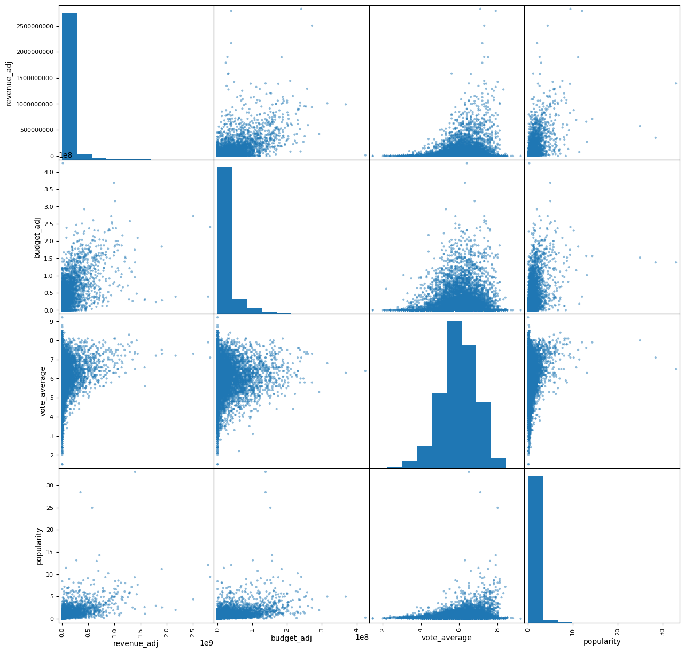
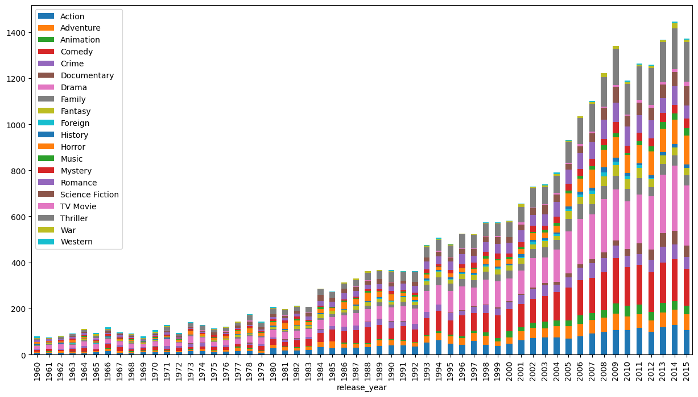
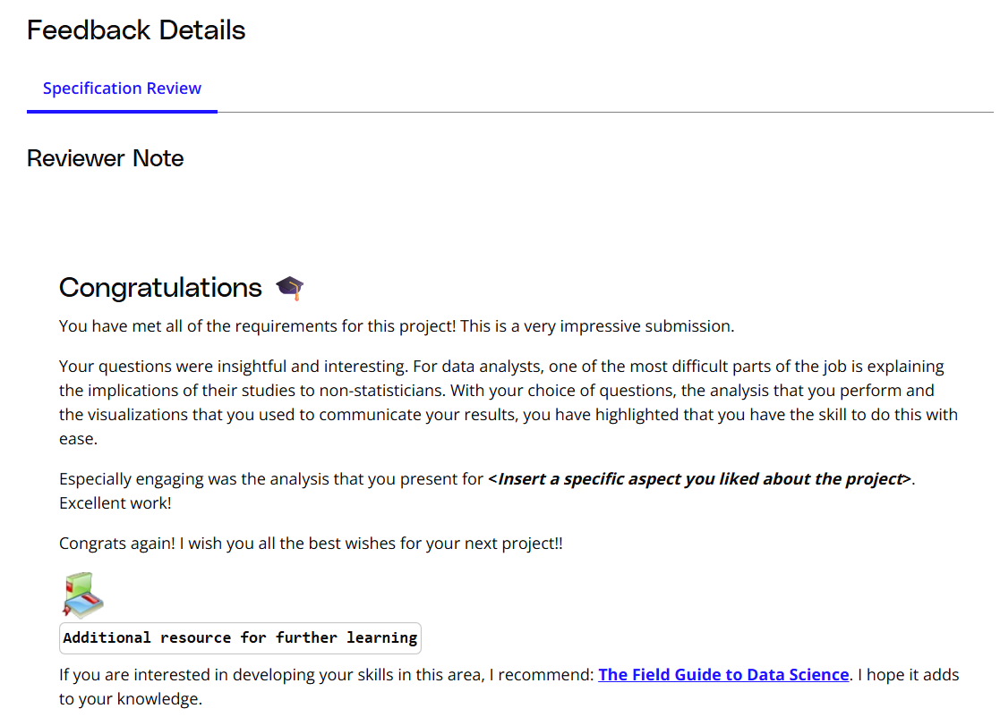

# Investigate a Dataset  

## Project Overview  
This project is part of the **Udacity Data Analyst Nanodegree**. The goal is to conduct a complete **exploratory data analysis (EDA)** on a dataset of choice, using Python, pandas, and NumPy, to answer interesting questions and present findings in a clear, shareable report.  

The project is open-ended: there is no single "right answer." The focus is on exploring relationships between variables, analyzing trends, and communicating insights effectively.  

---

## Dataset
**Dataset:** TMDb Movie Data (from Kaggle)  

**Description:**  
- Contains information on 10,000 movies, including budget, revenue, genres, cast, and ratings.  
- Some columns include multiple values separated by `|`.  
- Budget and revenue are provided in adjusted form (`_adj` columns) to account for inflation.  

---

## Key Questions Explored

1. [Factors affecting revenue](#factors-affecting-revenue)  
   - Revenue vs. budget  
     - Highest revenue movie and its budget  
     - Highest budget movie and its revenue  
   - Revenue vs. vote average  
   - Revenue vs. popularity  
   - Count of successful vs. failed movies  

2. [Movies by genre](#movies-by-genre)  
   - Most popular genres year by year  
   - Most popular genre overall  
   - Most popular genre in the most common year  

---

## Visual Overview

Click an image to jump to its analysis:

---

## Analysis and Findings  
The project workflow includes:  

1. **Data Cleaning:** Handle missing values, duplicates, and formatting inconsistencies.  
2. **Exploratory Data Analysis (EDA):**  
   - Investigated relationships between multiple variables.  
   - Used visualizations to summarize trends and patterns.  
3. **Insights:**  
   - Popularity of genres over years  
   - Factors influencing revenue  
   - Correlations between budget, vote counts, and revenue  

Visualizations and findings are contained in the Jupyter Notebook `Investigate_a_Dataset.ipynb`. 

---

## Reviewer Feedback  
- **Image:**
  
- **Summary:** Key points from reviewer:  
  - Analysis was thorough and well-documented  
  - Visualizations were clear and informative  
  - Conclusions were supported by the data  

---

## Tools and Technologies Used  
- Python  
- Jupyter Notebook  
- pandas, NumPy  
- Matplotlib  

---

## License  
Created by **Tala AbuSoud**. All rights reserved; not licensed for reuse.

